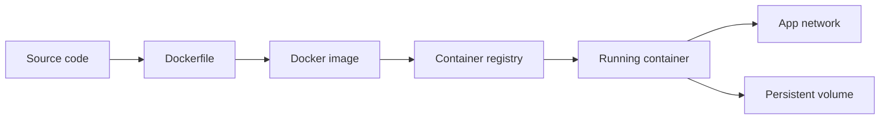
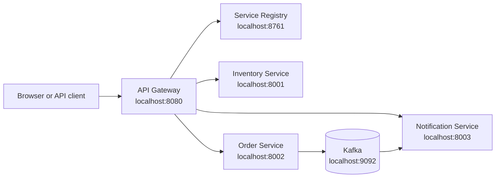

# Docker Guide

A practical Docker guide for full-stack developers, from containers to local microservice development.

## 1. What Docker solves

Docker packages an application and its runtime into a portable **container**. The same image can run on a developer laptop, CI server, or cloud platform.



### Important terms

- **Image:** Read-only template containing application code, dependencies, and startup metadata.
- **Container:** A running instance of an image.
- **Dockerfile:** Instructions used to build an image.
- **Registry:** Server that stores images, such as Docker Hub, GHCR, or Azure Container Registry.
- **Volume:** Docker-managed persistent storage.
- **Network:** Virtual network that lets containers communicate by name.
- **Tag:** Image version, such as `my-api:1.2.0`.

A container is an isolated process that shares the host operating system kernel. It is not a virtual machine. Good containers are immutable, ephemeral, small, and focused on one service.

## 2. Essential commands

```bash
# Verify installation
docker version
docker info

# Download and inspect an image
docker pull nginx:alpine
docker image ls
docker image inspect nginx:alpine

# Run a container
docker run --name web -d -p 8080:80 nginx:alpine
docker ps
docker ps -a

# View output and enter a running container
docker logs web
docker logs -f web
docker exec -it web sh

# Stop, start, restart, and remove
docker stop web
docker start web
docker restart web
docker rm web
docker rm -f web

# Clean unused resources
docker image prune
docker container prune
docker system df
```

`-d` runs in the background. `-p HOST_PORT:CONTAINER_PORT` publishes a port. The container port is where the application listens inside the container.

## 3. Build and run images

```bash
docker build -t my-api:1.0.0 .
docker image ls my-api
docker run --name my-api -p 8080:8080 my-api:1.0.0
```

Prefer immutable version tags in CI/CD. Avoid using `latest` in production because it does not identify an exact build.

Pass configuration at runtime:

```bash
docker run --rm \
  --name my-api \
  -p 8080:8080 \
  -e SPRING_PROFILES_ACTIVE=prod \
  -e DATABASE_URL='jdbc:postgresql://db:5432/app' \
  my-api:1.0.0
```

Never put passwords, API keys, or tokens in a Dockerfile or commit them to source control.

## 4. Dockerfiles

### Java and Spring Boot

```dockerfile
FROM eclipse-temurin:21-jdk AS build
WORKDIR /workspace
COPY . .
RUN ./mvnw -B -DskipTests package

FROM eclipse-temurin:21-jre
WORKDIR /app
RUN useradd --system --uid 10001 appuser
COPY --from=build /workspace/target/*.jar app.jar
USER 10001
EXPOSE 8080
ENTRYPOINT ["java", "-jar", "/app/app.jar"]
```

### Node frontend served by Nginx

```dockerfile
FROM node:22-alpine AS build
WORKDIR /app
COPY package*.json ./
RUN npm ci
COPY . .
RUN npm run build

FROM nginx:alpine
COPY --from=build /app/dist /usr/share/nginx/html
EXPOSE 80
```

### Dockerfile instructions

- `FROM`: selects the base image.
- `WORKDIR`: sets the working directory.
- `COPY`: copies files into the image.
- `RUN`: executes a build-time command.
- `ENV`: defines image environment defaults; do not use it for secrets.
- `EXPOSE`: documents a listening port; it does not publish the port.
- `USER`: runs the process without root privileges.
- `ENTRYPOINT` or `CMD`: defines the startup command.

### `.dockerignore`

```text
.git
.idea
.vscode
node_modules
coverage
target
.env
*.log
```

### Image checklist

- Use multi-stage builds.
- Pin base image versions; use digests for production where practical.
- Run as a non-root user.
- Keep secrets outside the image.
- Add a `.dockerignore` file.
- Add a health endpoint or health check.
- Scan images before release.

## 5. Networking and storage

Containers on the same user-defined network resolve each other by name. Inside a Compose network, connect to `db:5432`, not `localhost:5432`. `localhost` inside a container means that same container.

```bash
docker network create app-net
docker run -d --name db --network app-net postgres:16
docker run --rm --network app-net my-api:1.0.0
```

### Volumes

```bash
docker volume create postgres-data
docker volume ls
docker run -d \
  --name db \
  -v postgres-data:/var/lib/postgresql/data \
  -e POSTGRES_PASSWORD=local-dev-only \
  postgres:16
```

Use named volumes for local database data. For production, prefer a managed database or a deliberately designed storage system rather than treating a container filesystem as durable.

## 6. Docker Compose

Compose runs related services from one YAML file.

```yaml
services:
  frontend:
    build: ./frontend
    ports:
      - "3000:80"
    depends_on:
      api:
        condition: service_healthy

  api:
    build: ./api
    environment:
      DATABASE_URL: postgresql://db:5432/app
    ports:
      - "8080:8080"
    depends_on:
      db:
        condition: service_healthy
    healthcheck:
      test:
        [
          "CMD",
          "wget",
          "--spider",
          "-q",
          "http://localhost:8080/actuator/health",
        ]
      interval: 10s
      timeout: 5s
      retries: 5

  db:
    image: postgres:16
    environment:
      POSTGRES_DB: app
      POSTGRES_USER: app
      POSTGRES_PASSWORD: local-dev-only
    volumes:
      - db-data:/var/lib/postgresql/data
    healthcheck:
      test: ["CMD-SHELL", "pg_isready -U app -d app"]
      interval: 5s
      timeout: 5s
      retries: 5

volumes:
  db-data:
```

### Compose commands

```bash
docker compose up -d
docker compose up --build
docker compose ps
docker compose logs -f api
docker compose exec api sh
docker compose config
docker compose restart api
docker compose stop
docker compose down
docker compose down -v  # Also deletes named volumes
```

`depends_on` controls startup order, not application readiness. Health checks help, but applications should still retry transient dependency failures.

## 7. This project's Docker workflow

This repository contains an API gateway, service registry, inventory service, order service, notification service, and Kafka.



| Component            | Local port | Role                             |
| -------------------- | ---------: | -------------------------------- |
| API gateway          |     `8080` | Client entry point and routing   |
| Inventory Service    |     `8001` | Inventory operations             |
| Order Service        |     `8002` | Orders and event producer        |
| Notification Service |     `8003` | Event consumer and notifications |
| Service registry     |     `8761` | Service discovery                |
| Kafka                |     `9092` | Event streaming                  |

Start Kafka from the repository root:

```bash
docker compose -f docker-compose.kafka.yml up -d
docker compose -f docker-compose.kafka.yml ps
docker logs -f microservice-kafka
docker compose -f docker-compose.kafka.yml down
```

Host applications use `localhost:9092`. Another container on the Compose network should use `kafka:19092`. See [KAFKA.md](KAFKA.md) for the Kafka architecture.

Start the Spring Boot services in separate terminals:

```bash
(cd serviceregistry && ./mvnw spring-boot:run)
(cd Inventory-Service && ./mvnw spring-boot:run)
(cd Order-Service && ./mvnw spring-boot:run)
(cd Notification-Service && ./mvnw spring-boot:run)
(cd apigateway && ./mvnw spring-boot:run)
```

When containerized, replace host-specific addresses with Docker service names. Kubernetes uses a similar idea through Service DNS names.

## 8. Learning path

### Beginner

1. Run `nginx` with `docker run`.
2. Build a small frontend or API image.
3. Learn ports, logs, networks, volumes, and environment variables.
4. Run an API and database with Compose.

### Intermediate

1. Add health checks and retry behavior.
2. Use multi-stage builds and image scanning.
3. Push images to a registry.
4. Add CI steps for test, build, scan, and push.
5. Move the Compose application to Kubernetes.

## 9. Quick cheat sheet

```bash
docker build -t app:1.0 .
docker run --rm -p 8080:8080 app:1.0
docker ps
docker logs -f <container>
docker exec -it <container> sh
docker compose up -d --build
docker compose down
```
