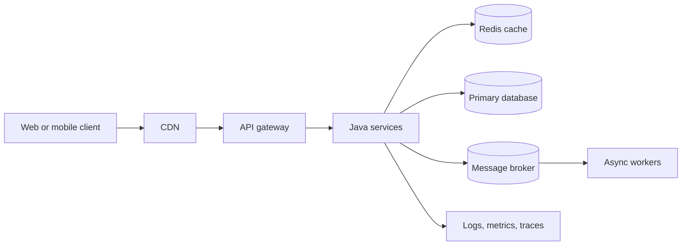
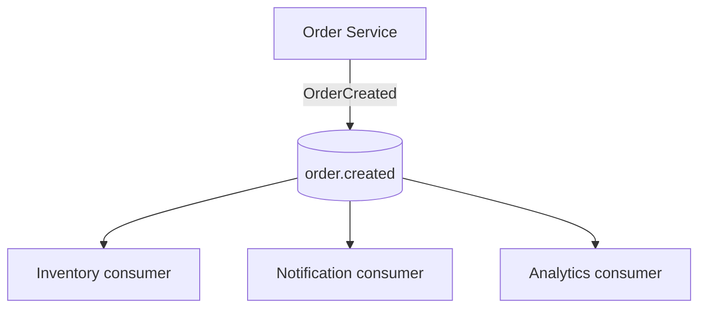
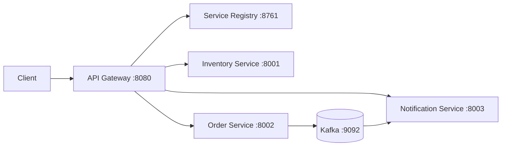
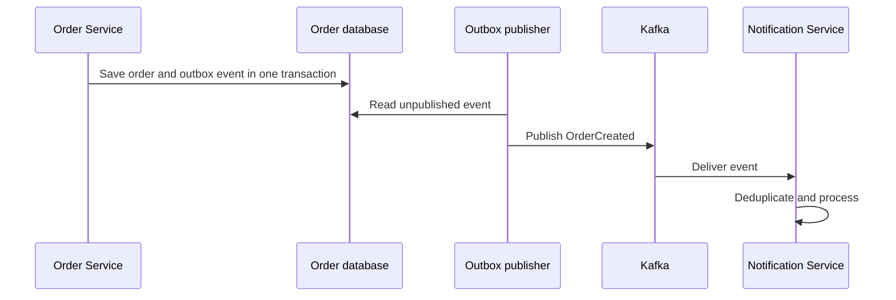
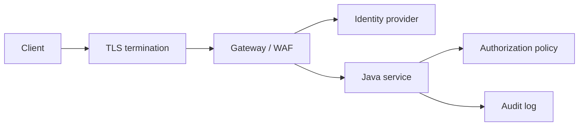
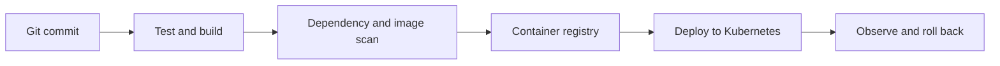

# High-Level Design with Java

A topic-wise guide to designing reliable, scalable systems and connecting those decisions to Java and Spring Boot implementation.

## 1. What HLD covers

High-Level Design describes the major components, data flows, boundaries, and operational choices of a system.



HLD decisions should answer:

- How does a request flow through the system?
- Where is data stored and who owns it?
- What happens when a dependency is slow or unavailable?
- How does the system scale?
- How are security, deployment, and observability handled?

## 2. A repeatable HLD process

1. Clarify functional requirements and out-of-scope behavior.
2. Estimate traffic, storage, payload size, and growth.
3. Define APIs and major user flows.
4. Identify bounded contexts and service ownership.
5. Choose storage, caching, and communication models.
6. Design for failure, security, observability, and operations.
7. Explain tradeoffs and alternatives.
8. Validate the design with bottleneck and failure scenarios.

Do not choose technologies before understanding traffic, consistency, latency, and operational constraints.

## 3. Requirements and capacity estimates

Separate requirements into:

- **Functional:** What the system must do.
- **Availability:** How much downtime is acceptable.
- **Latency:** Response-time target, often stated as p95 or p99.
- **Throughput:** Requests or events per second.
- **Consistency:** How quickly all readers must see a write.
- **Durability:** Acceptable data-loss window.
- **Security:** Authentication, authorization, privacy, and audit needs.

Example estimate:

```text
10,000,000 users
10% daily active users = 1,000,000 users/day
10 requests per active user = 10,000,000 requests/day
Average = about 116 requests/second
Peak at 10x average = about 1,160 requests/second
```

For storage, estimate `records per day x average record size x retention period`, then add indexes, replicas, backups, and growth margin.

## 4. Architecture styles

### Monolith

One deployable application with internal modules. It is often the best starting point when the domain and scaling needs are still changing.

### Modular monolith

One deployment with strong module boundaries. It provides simpler operations while preserving the option to split modules later.

### Microservices

Independently deployable services organized around business capabilities. Use them when independent scaling, ownership, deployment, or fault isolation justifies the operational cost.

### Event-driven architecture

Services publish events and consumers react asynchronously. This improves decoupling and throughput, but introduces eventual consistency, duplicate delivery, ordering, and replay concerns.



## 5. Service boundaries

Good boundaries usually follow a business capability and data ownership. A service should own the rules and writes for its data instead of sharing tables directly with other services.

For this repository, a reasonable conceptual split is:



Avoid splitting a system into services that always deploy, scale, and transact together. A distributed monolith is harder to operate than a modular monolith.

## 6. API design

### REST principles

- Use nouns for resources: `/orders`, `/inventory/items`.
- Use HTTP methods consistently: `GET`, `POST`, `PUT`, `PATCH`, `DELETE`.
- Return stable error shapes.
- Validate input at the edge.
- Use pagination for collections.
- Support idempotency for retried writes.
- Version deliberately when compatibility must change.

Example Spring Boot boundary:

```java
@RestController
@RequestMapping("/orders")
public class OrderController {
    private final OrderApplicationService service;

    public OrderController(OrderApplicationService service) {
        this.service = service;
    }

    @PostMapping
    public ResponseEntity<CreateOrderResponse> create(
            @Valid @RequestBody CreateOrderRequest request) {
        var result = service.create(request);
        return ResponseEntity.status(HttpStatus.CREATED).body(result);
    }
}
```

### Synchronous versus asynchronous communication

| Synchronous                       | Asynchronous                    |
| --------------------------------- | ------------------------------- |
| Immediate response                | Higher decoupling               |
| Simple request flow               | Better burst handling           |
| Caller waits for dependency       | Consumer processes later        |
| Timeout and availability coupling | Duplicate and ordering concerns |

Use synchronous calls for request-time decisions. Use events or queues for notifications, long-running work, integration, and workloads that can be eventually consistent.

## 7. Data and storage design

Choose storage by access pattern and consistency needs:

- Relational database for transactions, relationships, and strong constraints.
- Document database for aggregate-shaped records and flexible schema.
- Key-value store for fast lookup by key.
- Search engine for text search and filtering.
- Object storage for images, videos, and large files.
- Time-series database for timestamped measurements.

### Database per service

Each service owns its schema and exposes data through an API or events. Cross-service joins become application workflows or read models.

### Indexing

Index columns used in frequent filters, joins, and ordering. Confirm with query plans. Every index improves some reads but increases write cost and storage.

### Transactions

Keep ACID transactions within one database boundary where possible. For distributed workflows, use a Saga, transactional outbox, compensation, or a workflow engine.

## 8. Caching

Caching can reduce latency and database load, but introduces staleness and invalidation complexity.

Common strategies:

- **Cache-aside:** Application reads cache, then loads and stores a miss.
- **Read-through:** Cache layer loads data on a miss.
- **Write-through:** Writes update the cache and backing store together.
- **Write-behind:** Cache writes later to storage; higher data-loss risk.

```java
@Cacheable(cacheNames = "products", key = "#productId")
public Product findProduct(UUID productId) {
    return repository.findById(productId).orElseThrow();
}
```

Set TTLs, define behavior on cache failure, prevent cache stampedes, and never assume cached data is authoritative unless the design guarantees it.

## 9. Reliability patterns

### Timeouts

Every network call needs a bounded timeout. A timeout should be shorter than the caller's remaining request budget.

### Retries

Retry only transient failures. Use exponential backoff and jitter. Do not retry non-idempotent operations unless protected by an idempotency key.

### Circuit breaker

Stop calling a failing dependency temporarily, return a fallback or a clear error, and periodically test recovery.

### Bulkhead

Isolate resources so one dependency or workload cannot consume every thread, connection, or queue slot.

### Rate limiting

Protect services and enforce quotas by user, token, IP, or tenant.

### Idempotency

An operation is idempotent when repeating the same request produces the same business result. Store an idempotency key and result for important retried commands.

## 10. Messaging and event delivery

At-least-once delivery is common, so consumers must tolerate duplicates.



Important decisions:

- Topic and event naming.
- Partition key and ordering scope.
- Consumer group ownership.
- Retry topic and dead-letter handling.
- Event schema compatibility.
- Retention and replay policy.
- Deduplication and idempotent side effects.

The transactional outbox avoids the failure gap where a database write succeeds but event publication fails.

## 11. Consistency and distributed transactions

- **Strong consistency:** Readers see committed writes immediately within the defined boundary.
- **Eventual consistency:** Replicas or read models converge later.
- **Saga:** A sequence of local transactions with compensating actions for failure.
- **CQRS:** Separate models for commands and queries when their needs differ.

Do not promise a cross-service transaction unless the implementation truly coordinates it. Communicate intermediate states such as `PENDING`, `CONFIRMED`, or `FAILED` to clients when a workflow is asynchronous.

## 12. Security architecture



- Authenticate users with OAuth 2.0 or OpenID Connect.
- Authorize every protected operation; authentication alone is not authorization.
- Prefer short-lived tokens and validate issuer, audience, expiry, and signature.
- Apply least privilege to service accounts and databases.
- Keep secrets in a secret manager.
- Encrypt traffic and sensitive data.
- Do not log passwords, tokens, or personal data unnecessarily.
- Add audit events for security-sensitive actions.

## 13. Observability

Use the three pillars:

- **Logs:** Structured events with correlation IDs.
- **Metrics:** Request rate, errors, latency, saturation, queue depth, and business signals.
- **Traces:** Cross-service request spans and dependency timing.

For Java, common choices include Micrometer, Spring Boot Actuator, OpenTelemetry, Prometheus, and Grafana. Propagate a trace or correlation ID across HTTP and messaging boundaries.

## 14. Deployment and scaling

A typical deployment flow is:



Scale stateless services horizontally. Use a load balancer or Service to distribute traffic. Define resource requests, limits, health probes, graceful shutdown, and rolling update behavior. Scale databases according to their supported replication and partitioning model.

## 15. Common HLD interview topics

### URL shortener

Discuss ID generation, redirect latency, cache strategy, collision handling, analytics, abuse prevention, and read-heavy scaling.

### Rate limiter

Discuss fixed window, sliding window, token bucket, distributed counters, clock behavior, and fail-open versus fail-closed decisions.

### Notification system

Discuss channel adapters, templates, preferences, retries, dead letters, deduplication, scheduling, and provider quotas.

### File storage service

Discuss object storage, metadata, upload/download authorization, multipart uploads, virus scanning, CDN, and lifecycle policies.

### News feed

Discuss fan-out on write versus read, ranking, pagination, cache invalidation, and celebrity accounts.

### Order system

Discuss inventory reservation, payment state, outbox events, Saga compensation, idempotency, and audit history.

## 16. HLD review checklist

- Are requirements and estimates explicit?
- Does each service have clear ownership of data and business rules?
- What is the bottleneck at peak load?
- What happens when each dependency fails?
- Are retries bounded and safe?
- Is the consistency model intentional?
- How are authentication, authorization, secrets, and audit handled?
- Can operators detect and diagnose failures?
- Can the system deploy and roll back safely?
- What tradeoff made the design simpler or more reliable?

## 17. Suggested learning order

1. HTTP, REST, databases, indexing, and caching.
2. Load balancing, replication, partitioning, and queues.
3. Reliability, consistency, idempotency, and distributed workflows.
4. Security and observability.
5. Kubernetes deployment concepts in [KUBERNETES.md](KUBERNETES.md).
6. Practice one design at a time with estimates and failure scenarios.
