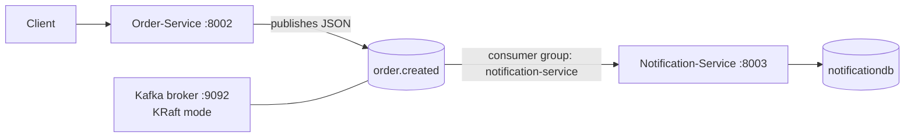
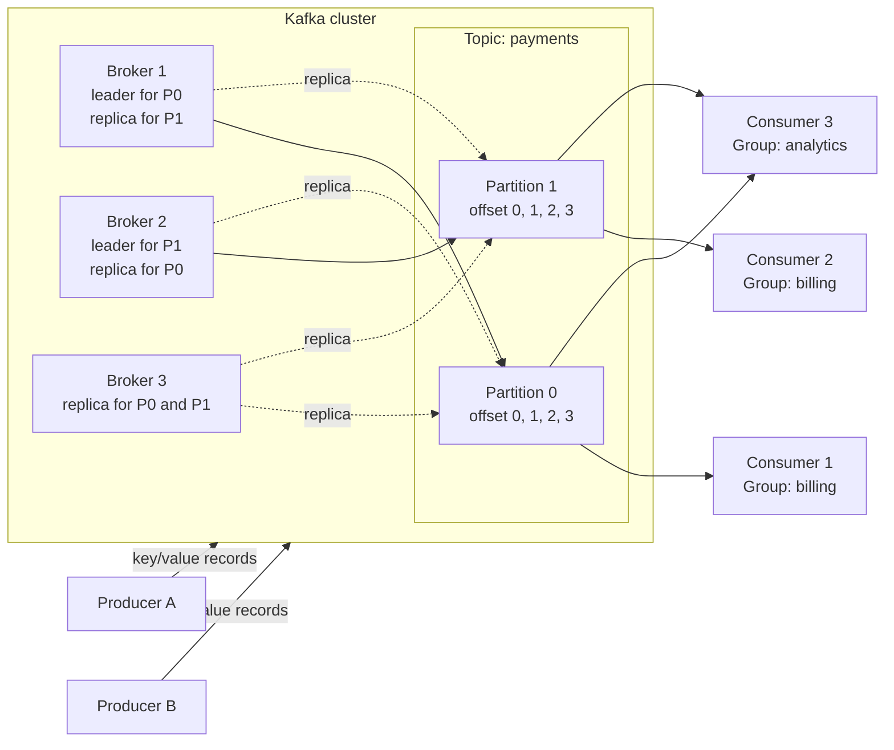

# Kafka Guide

This project uses Apache Kafka to send order events from `Order-Service` to `Notification-Service`.

## Architecture



### Message flow

1. A client creates an order through `Order-Service`.
2. `Order-Service` saves the order and publishes an `OrderCreatedEvent`.
3. The event is sent to the `order.created` topic.
4. `Notification-Service` consumes the event.
5. `Notification-Service` creates a notification in `notificationdb`.

## Apache Kafka architecture

Kafka is a distributed event streaming platform. Producers write records to topics, Kafka brokers store and serve those records, and consumers read the records. Kafka keeps records for a configured retention period, so consumers can read them later or replay them from an earlier offset.



### Kafka cluster

A Kafka cluster is a group of Kafka servers working together. Each server is called a broker. A cluster provides shared storage, partition distribution, replication, and horizontal scaling. Clients connect to the cluster through one or more bootstrap broker addresses; Kafka then tells the client which broker owns each partition.

This project uses a single-broker cluster for local development. It has no redundancy because there is only one broker and each topic has one replica.

### Kafka broker

A broker is one Kafka server. It accepts records from producers, stores partition data on disk, serves records to consumers, and coordinates partition leadership. In a multi-broker cluster, partitions are distributed across brokers and replicas can be kept on other brokers.

The local broker in this project runs in the `microservice-kafka` Docker container and is available to applications at `localhost:9092`.

### Producer

A producer is an application that publishes records to Kafka. A record normally contains a key, a value, and optional headers and timestamp. The producer selects a topic partition directly or Kafka selects one based on the record key.

In this project, `Order-Service` is the producer. It publishes an order-created JSON event to `order.created`, using the order ID as the message key.

### Topic

A topic is a named stream of records. It separates one kind of event from another, such as `order.created`, `payment.completed`, or `inventory.reserved`. A topic is not stored as one single file; it is divided into partitions.

Kafka topics are append-only from the consumer's point of view. Records are normally not deleted when a consumer reads them. Kafka removes old records according to the topic retention policy.

### Partition

A partition is an ordered, append-only log inside a topic. Each record receives a monotonically increasing offset within its partition. Kafka guarantees ordering inside one partition, but not ordering across different partitions.

Partitions provide parallelism. A topic with multiple partitions can be read by multiple consumers at the same time. Records with the same key are normally sent to the same partition, which preserves ordering for that key.

In this project, `order.created` has one partition, so it has one ordered stream and limited parallelism.

### Consumer

A consumer is an application that reads records from Kafka. It tracks its position using offsets and can continue from its last committed position after restarting. A consumer can also replay records by resetting its offsets or reading from the beginning.

`Notification-Service` is the consumer in this project. It reads `order.created` and creates a notification for each order-created event.

### Consumer group

A consumer group is a set of consumers that cooperate to read a topic. Kafka assigns each partition to at most one active consumer in a group at a time. This allows a topic to be processed in parallel while ensuring that one record is not normally delivered to multiple consumers in the same group.

Different consumer groups receive independent views of the same topic. For example, a `billing` group and an `analytics` group can both read every record, with each group maintaining its own offsets.

The `Notification-Service` uses the consumer group `notification-service`. Because `order.created` currently has one partition, only one active consumer in that group can process it at a time.

### Replication and leaders

Replication stores copies of a partition on multiple brokers. One replica is the leader and handles normal reads and writes; the other replicas are followers that copy the leader's data. If the leader fails, Kafka can elect an in-sync follower as the new leader.

Replication is different from partitions: partitions provide ordering and parallelism, while replicas provide fault tolerance. This local project uses one replica, so it does not provide broker failure protection.

### KRaft controller

Modern Kafka can use KRaft mode instead of ZooKeeper. KRaft uses Kafka's built-in controller quorum to manage cluster metadata, broker membership, topic configuration, partition leadership, and elections.

This project uses a combined broker/controller node in KRaft mode. ZooKeeper is not required.

## Current Kafka configuration

| Setting                   | Value                                   |
| ------------------------- | --------------------------------------- |
| Kafka image               | `apache/kafka:4.0.0`                    |
| Container name            | `microservice-kafka`                    |
| Client address from macOS | `localhost:9092`                        |
| Internal broker address   | `kafka:19092`                           |
| Controller address        | `localhost:9093` inside the Kafka setup |
| Mode                      | KRaft, combined broker and controller   |
| Broker node ID            | `1`                                     |
| Partitions                | `1`                                     |
| Replicas                  | `1`                                     |
| Security                  | PLAINTEXT, development only             |
| ZooKeeper                 | Not required                            |

The broker configuration is in [docker-compose.kafka.yml](docker-compose.kafka.yml).

## Topic and event configuration

### Topic

- Name: `order.created`
- Partitions: `1`
- Replicas: `1`
- Created automatically by `Order-Service` through its `NewTopic` bean.

For production, increase partitions and replication factors according to the required throughput and availability.

### Producer: Order-Service

`Order-Service` connects to `${KAFKA_BOOTSTRAP_SERVERS:localhost:9092}` and uses:

- Key serializer: `StringSerializer`
- Value serializer: Spring Kafka `JsonSerializer`
- Topic: `order.created`
- Message key: the order ID as a string
- Message value: the JSON order-created event

The event contains:

```json
{
  "orderId": 123,
  "customerEmail": "customer@example.com",
  "totalPrice": 49.99,
  "status": "CONFIRMED"
}
```

### Consumer: Notification-Service

`Notification-Service` connects to `${KAFKA_BOOTSTRAP_SERVERS:localhost:9092}` and uses:

- Topic: `order.created`
- Consumer group: `notification-service`
- Offset reset: `earliest`
- Key deserializer: `StringDeserializer`
- Value deserializer: Spring Kafka `JsonDeserializer`
- Trusted event package: `com.microservice.notificationservice.messaging`

The consumer group makes sure each event is processed once by one active consumer in this service group. A new consumer reads old messages because the offset policy is `earliest`, when no committed offset exists.

## Start Kafka with Docker

Make sure Docker Desktop is running, then run these commands from the repository root:

```bash
docker compose -f docker-compose.kafka.yml up -d
```

Check the container:

```bash
docker compose -f docker-compose.kafka.yml ps
```

Follow Kafka logs:

```bash
docker compose -f docker-compose.kafka.yml logs -f kafka
```

Stop Kafka:

```bash
docker compose -f docker-compose.kafka.yml down
```

Stop Kafka and remove its stored volumes, if volumes are added later:

```bash
docker compose -f docker-compose.kafka.yml down -v
```

## Topic commands

List topics:

```bash
docker exec -it microservice-kafka /opt/kafka/bin/kafka-topics.sh \
  --bootstrap-server localhost:9092 --list
```

Describe the project topic:

```bash
docker exec -it microservice-kafka /opt/kafka/bin/kafka-topics.sh \
  --bootstrap-server localhost:9092 \
  --describe --topic order.created
```

Create the topic manually if `Order-Service` has not started yet:

```bash
docker exec -it microservice-kafka /opt/kafka/bin/kafka-topics.sh \
  --bootstrap-server localhost:9092 \
  --create --topic order.created --partitions 1 --replication-factor 1
```

Delete the topic during local development:

```bash
docker exec -it microservice-kafka /opt/kafka/bin/kafka-topics.sh \
  --bootstrap-server localhost:9092 \
  --delete --topic order.created
```

## Read messages from the terminal

Read new messages and existing messages from the beginning:

```bash
docker exec -it microservice-kafka /opt/kafka/bin/kafka-console-consumer.sh \
  --bootstrap-server localhost:9092 \
  --topic order.created \
  --from-beginning
```

Read only newly arriving messages:

```bash
docker exec -it microservice-kafka /opt/kafka/bin/kafka-console-consumer.sh \
  --bootstrap-server localhost:9092 \
  --topic order.created
```

Show message keys and values:

```bash
docker exec -it microservice-kafka /opt/kafka/bin/kafka-console-consumer.sh \
  --bootstrap-server localhost:9092 \
  --topic order.created \
  --from-beginning \
  --property print.key=true \
  --property print.value=true \
  --property key.separator=' | '
```

Press `Ctrl+C` to stop the consumer.

## Send a test message from the terminal

Start a producer:

```bash
docker exec -it microservice-kafka /opt/kafka/bin/kafka-console-producer.sh \
  --bootstrap-server localhost:9092 \
  --topic order.created
```

Paste one JSON message per line. For example:

```json
{
  "orderId": 999,
  "customerEmail": "test@example.com",
  "totalPrice": 25.5,
  "status": "CONFIRMED"
}
```

Note: the terminal producer sends plain text. `Notification-Service` expects a JSON event with the fields shown above, so this test is useful only when the consumer event type and JSON format match.

## Consumer group commands

List consumer groups:

```bash
docker exec -it microservice-kafka /opt/kafka/bin/kafka-consumer-groups.sh \
  --bootstrap-server localhost:9092 --list
```

Describe the notification consumer group:

```bash
docker exec -it microservice-kafka /opt/kafka/bin/kafka-consumer-groups.sh \
  --bootstrap-server localhost:9092 \
  --describe --group notification-service
```

Reset the notification group to the beginning for local testing. Stop `Notification-Service` first:

```bash
docker exec -it microservice-kafka /opt/kafka/bin/kafka-consumer-groups.sh \
  --bootstrap-server localhost:9092 \
  --group notification-service \
  --topic order.created \
  --reset-offsets --to-earliest --execute
```

## Service startup order

A typical local startup sequence is:

```bash
# Terminal 1: Kafka
cd /Users/darkarmy/Desktop/microservice-application
docker compose -f docker-compose.kafka.yml up -d

# Terminal 2: service registry
cd serviceregistry
./mvnw spring-boot:run

# Terminal 3: Order-Service
cd Order-Service
./mvnw spring-boot:run

# Terminal 4: Notification-Service
cd Notification-Service
./mvnw spring-boot:run
```

The order and notification services default to `localhost:9092`. To use another broker address, set the environment variable before starting a service:

```bash
export KAFKA_BOOTSTRAP_SERVERS=localhost:9092
```

## Troubleshooting

### Cannot connect to Kafka

Check Docker and the broker:

```bash
docker info
docker compose -f docker-compose.kafka.yml ps
docker compose -f docker-compose.kafka.yml logs --tail=100 kafka
```

Confirm port `9092` is listening:

```bash
nc -vz localhost 9092
```

### Port 9092 is already in use

Find the process using the port:

```bash
lsof -nP -iTCP:9092 -sTCP:LISTEN
```

Stop the other Kafka process or change the host port in `docker-compose.kafka.yml` and update `KAFKA_BOOTSTRAP_SERVERS` accordingly.

### Topic does not exist

Start `Order-Service`, which declares `order.created`, or create it manually with the topic command above.

### No messages are visible

- Confirm that an order was successfully created.
- Check that the producer and consumer use the same topic name.
- Confirm `Order-Service` and `Notification-Service` both use `localhost:9092`.
- Check the consumer group offsets with `kafka-consumer-groups.sh`.
- Run the console consumer with `--from-beginning`.

## Development versus production

This Compose setup is intended for local development. It uses one broker, one controller, one partition, one replica, and PLAINTEXT communication. It does not provide high availability or encryption.

A production deployment should normally use multiple Kafka brokers, replicated topics, persistent storage, authentication, TLS encryption, monitoring, backup and recovery procedures, and an agreed retention policy.
