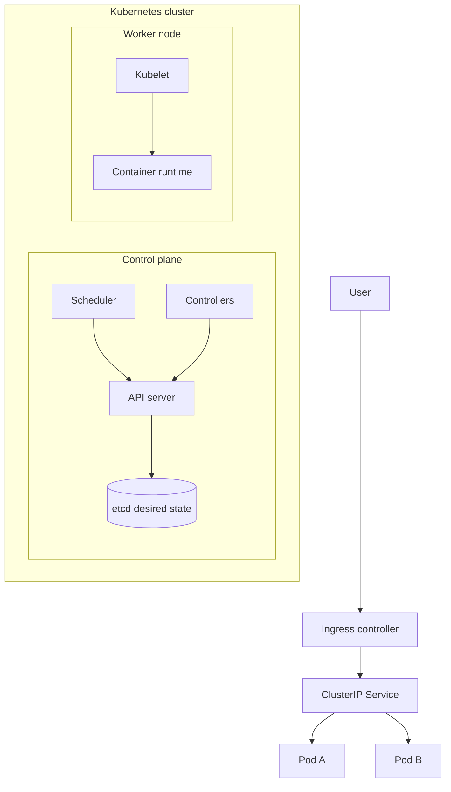
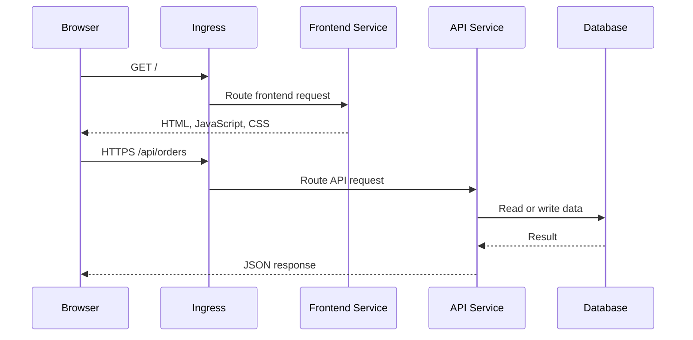
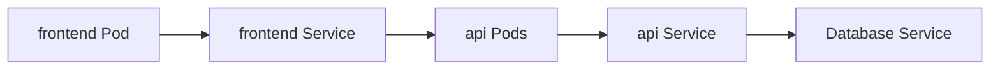

# Kubernetes Guide

A practical Kubernetes guide for full-stack developers, from Pods and Services to production-oriented operations.

## 1. What Kubernetes solves

Kubernetes runs and manages containers across one or more machines. It keeps the desired number of application instances running, routes traffic, replaces failed instances, and supports rolling updates.



### Kubernetes versus Docker Compose

| Docker Compose                    | Kubernetes                       |
| --------------------------------- | -------------------------------- |
| Local multi-container development | Cluster orchestration            |
| `service`                         | Deployment plus Service          |
| `ports`                           | Service and possibly Ingress     |
| `environment`                     | ConfigMap or Secret references   |
| `volumes`                         | PersistentVolumeClaim            |
| `depends_on`                      | Readiness probes and retry logic |
| `scale`                           | Deployment replicas or HPA       |

Kubernetes is declarative: you describe the desired state, and controllers continuously work to make the actual state match it.

## 2. Core Kubernetes objects

- **Cluster:** The complete Kubernetes environment.
- **Node:** A VM or machine that runs Pods.
- **Pod:** The smallest deployable unit, usually containing one application container.
- **Deployment:** Maintains Pod replicas and performs rolling updates.
- **Service:** Stable DNS name and virtual IP for a group of Pods.
- **Ingress:** HTTP/HTTPS routing from outside the cluster to Services.
- **ConfigMap:** Non-secret configuration.
- **Secret:** Sensitive configuration; protect access and encryption at rest.
- **Namespace:** Logical boundary for teams or environments.
- **PersistentVolumeClaim:** A request for persistent storage.
- **Job/CronJob:** One-off or scheduled work.
- **HorizontalPodAutoscaler:** Adjusts replica count based on metrics.

A Pod is not normally a replacement for a VM or a permanent server. Kubernetes may delete and recreate Pods, so persistent state belongs in external storage.

## 3. Essential commands

Install `kubectl`, then verify cluster access:

```bash
kubectl version --client
kubectl cluster-info
kubectl get nodes
kubectl config get-contexts
kubectl config current-context
kubectl config use-context <context-name>
```

Inspect resources:

```bash
kubectl get namespaces
kubectl get pods -A
kubectl get pods -n <namespace>
kubectl get deployments,services,ingress -n <namespace>
kubectl describe pod <pod-name> -n <namespace>
kubectl get events -n <namespace> --sort-by=.lastTimestamp
```

Apply and remove manifests:

```bash
kubectl apply -f k8s/
kubectl diff -f k8s/
kubectl delete -f k8s/
kubectl rollout status deployment/api -n app
kubectl rollout history deployment/api -n app
kubectl rollout undo deployment/api -n app
```

Debug workloads:

```bash
kubectl logs deployment/api -n app
kubectl logs -f pod/<pod-name> -n app
kubectl logs pod/<pod-name> -c <container-name> -n app
kubectl exec -it pod/<pod-name> -n app -- sh
kubectl port-forward service/api 8080:8080 -n app
kubectl top pods -n app
```

## 4. Namespaces and labels

Namespaces separate resources. Labels identify resources, and selectors connect related resources.

```bash
kubectl create namespace app
kubectl get all -n app
kubectl get pods -n app -l app=api
```

A Service sends traffic to Pods whose labels match its selector. A label typo can therefore make a healthy application unreachable.

## 5. Basic Deployment and Service

This example deploys two API replicas and exposes them internally.

```yaml
apiVersion: apps/v1
kind: Deployment
metadata:
  name: api
  namespace: app
spec:
  replicas: 2
  selector:
    matchLabels:
      app: api
  template:
    metadata:
      labels:
        app: api
    spec:
      containers:
        - name: api
          image: ghcr.io/example/api:1.0.0
          ports:
            - containerPort: 8080
          envFrom:
            - configMapRef:
                name: api-config
          resources:
            requests:
              cpu: 100m
              memory: 256Mi
            limits:
              cpu: 500m
              memory: 512Mi
          readinessProbe:
            httpGet:
              path: /actuator/health/readiness
              port: 8080
            periodSeconds: 10
          livenessProbe:
            httpGet:
              path: /actuator/health/liveness
              port: 8080
            initialDelaySeconds: 30
            periodSeconds: 20
---
apiVersion: v1
kind: Service
metadata:
  name: api
  namespace: app
spec:
  selector:
    app: api
  ports:
    - port: 8080
      targetPort: 8080
  type: ClusterIP
---
apiVersion: v1
kind: ConfigMap
metadata:
  name: api-config
  namespace: app
data:
  SPRING_PROFILES_ACTIVE: "kubernetes"
```

Apply it:

```bash
kubectl create namespace app
kubectl apply -f api.yaml
kubectl get pods -n app -w
```

## 6. Probes and resources

- **Readiness:** Should this Pod receive traffic? Failure removes it from Service endpoints.
- **Liveness:** Is this process stuck and should Kubernetes restart it?
- **Startup probe:** Does a slow-starting application need more time before liveness checks begin?

Do not use a deep dependency check as liveness. A temporary database outage should normally trigger retries or stop traffic, not restart every Pod.

Resource requests help the scheduler place Pods. Limits prevent unlimited resource usage, but a memory limit that is too low can cause `OOMKilled`.

## 7. Exposing applications

Service types:

- `ClusterIP`: internal-only default.
- `NodePort`: exposes a port on each node; useful for learning.
- `LoadBalancer`: asks the cloud provider for an external load balancer.

Ingress provides host and path routing:

```yaml
apiVersion: networking.k8s.io/v1
kind: Ingress
metadata:
  name: app-ingress
  namespace: app
spec:
  ingressClassName: nginx
  rules:
    - host: app.example.com
      http:
        paths:
          - path: /api
            pathType: Prefix
            backend:
              service:
                name: api
                port:
                  number: 8080
```

An Ingress resource needs an Ingress controller installed in the cluster. The resource alone does not create a load balancer.

## 8. Configuration and secrets

Use a ConfigMap for ordinary settings and a Secret for credentials:

```bash
kubectl create configmap api-config --from-literal=LOG_LEVEL=info -n app
kubectl create secret generic api-secrets \
  --from-literal=DATABASE_PASSWORD='change-me' -n app
```

For real environments, use a secret manager such as Azure Key Vault, AWS Secrets Manager, or Google Secret Manager and integrate it with Kubernetes. Kubernetes Secret values are base64-encoded, not automatically encrypted simply because they are in a Secret object.

## 9. Scaling and rolling updates

```bash
kubectl scale deployment api --replicas=4 -n app
kubectl autoscale deployment api --min=2 --max=10 --cpu-percent=70 -n app
kubectl set image deployment/api api=ghcr.io/example/api:1.1.0 -n app
kubectl rollout status deployment/api -n app
kubectl rollout undo deployment/api -n app
```

Horizontal Pod Autoscaling needs metrics and sensible CPU/memory requests. Scale stateless application Pods horizontally; use a database's supported replication and scaling model rather than blindly increasing database replicas.

## 10. Full-stack request flow



A common production layout is frontend static assets behind a CDN, an API behind an Ingress or API gateway, managed databases outside the cluster, and background workers consuming a queue or event broker.

## 11. Networking and DNS

A Kubernetes Service gives a stable name even when its Pods change. Inside the `app` namespace, an API can normally be reached as `http://api:8080`. Across namespaces, use a full name such as `api.app.svc.cluster.local`.



Use NetworkPolicies to restrict which Pods may communicate. A default-deny policy is a good production baseline when the cluster network plugin supports it.

## 12. Persistent storage

Deployments are best for stateless services. Databases and file uploads need persistent storage.

```yaml
apiVersion: v1
kind: PersistentVolumeClaim
metadata:
  name: database-data
  namespace: app
spec:
  accessModes:
    - ReadWriteOnce
  resources:
    requests:
      storage: 10Gi
```

A PersistentVolumeClaim requests storage from the cluster. Storage classes and access modes differ between local clusters and cloud providers. Managed databases are often simpler and safer for production.

## 13. Troubleshooting workflow

1. Confirm objects exist: `kubectl get pods,svc,deploy -n app`.
2. Check Pod details: `kubectl describe pod <pod> -n app`.
3. Read logs: `kubectl logs <pod> -n app`.
4. Check events: `kubectl get events -n app --sort-by=.lastTimestamp`.
5. Check labels and endpoints: `kubectl get endpoints api -n app`.
6. Test from inside the cluster with a temporary debug Pod.
7. Use port-forwarding to isolate Ingress and load balancer problems.

Common states:

- `Pending`: scheduling, resource, or volume binding problem.
- `ImagePullBackOff`: image name, tag, registry access, or credentials problem.
- `CrashLoopBackOff`: process starts and exits; inspect logs and configuration.
- `Running` but not ready: readiness probe or dependency problem.
- `OOMKilled`: memory limit is too low or the process uses too much memory.

## 14. Security checklist

- Use private registries and image vulnerability scanning.
- Pin image versions; do not deploy unreviewed `latest` images.
- Run containers as non-root with a read-only filesystem where practical.
- Store secrets in a secret manager and restrict RBAC access.
- Apply NetworkPolicies to limit service-to-service traffic.
- Set CPU and memory requests and limits.
- Configure probes thoughtfully.
- Use TLS at the edge and encrypt sensitive traffic where required.
- Keep the control plane and node images patched.
- Use separate namespaces and credentials for each environment.
- Centralize logs, metrics, and traces.
- Back up databases and test restoration.
- Define PodDisruptionBudgets for important replicated workloads.

## 15. Learning path

### Beginner

1. Install Docker Desktop, kind, or minikube.
2. Create a namespace and run an Nginx Deployment.
3. Expose it with a Service and use `kubectl port-forward`.
4. Practice logs, `describe`, labels, and selectors.

### Intermediate

1. Deploy a frontend and API with separate Deployments and Services.
2. Add ConfigMaps, Secrets, probes, and resource requests.
3. Add an Ingress and TLS.
4. Practice rolling updates, rollback, scaling, and debugging.
5. Add RBAC, NetworkPolicies, persistent storage, and CI/CD.

### Practice project

Containerize the frontend, API, PostgreSQL database, and worker. Run them with Docker Compose first. Move the frontend and API to Kubernetes, use a managed database, add an Ingress, configure probes, and perform a rolling update while watching requests and logs.

## 16. Quick cheat sheet

```bash
kubectl apply -f k8s/
kubectl get all -n app
kubectl describe pod <pod> -n app
kubectl logs -f deployment/api -n app
kubectl exec -it <pod> -n app -- sh
kubectl port-forward service/api 8080:8080 -n app
kubectl rollout status deployment/api -n app
kubectl rollout undo deployment/api -n app
kubectl scale deployment/api --replicas=3 -n app
```
