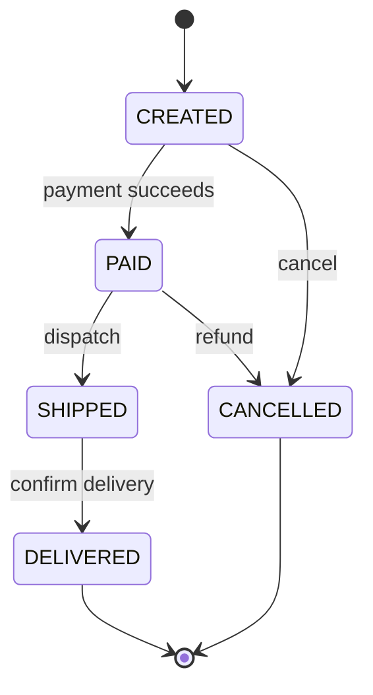

# Low-Level Design with Java

A topic-wise guide to designing classes, interfaces, APIs, and object collaborations. LLD focuses on **how the code is structured and behaves**.

## 1. LLD versus HLD

| LLD                              | HLD                          |
| -------------------------------- | ---------------------------- |
| Classes, interfaces, methods     | Services, databases, queues  |
| Object relationships             | System boundaries            |
| Validation and state transitions | Availability and scalability |
| Design patterns                  | Deployment and operations    |
| Unit-testable behavior           | End-to-end behavior          |

A good LLD should make responsibilities explicit, keep changes local, and be easy to test.

## 2. A repeatable LLD process

1. Clarify use cases and non-functional constraints.
2. Identify the main domain objects and their responsibilities.
3. Define public operations and input/output models.
4. Decide relationships: composition, association, inheritance, or dependency.
5. Model state transitions and invalid operations.
6. Introduce interfaces at real variation or external boundaries.
7. Walk through happy paths, failures, concurrency, and extension points.
8. Write focused tests for business rules.

Do not start by drawing many classes. Start from behavior and let the objects emerge from the use cases.

## 3. Core object-oriented principles

### Encapsulation

Keep state private and expose operations that preserve valid state.

```java
public final class BankAccount {
    private long balanceInCents;

    public BankAccount(long openingBalanceInCents) {
        if (openingBalanceInCents < 0) {
            throw new IllegalArgumentException("Opening balance cannot be negative");
        }
        this.balanceInCents = openingBalanceInCents;
    }

    public void withdraw(long amountInCents) {
        if (amountInCents <= 0 || amountInCents > balanceInCents) {
            throw new IllegalArgumentException("Invalid withdrawal");
        }
        balanceInCents -= amountInCents;
    }

    public long balanceInCents() {
        return balanceInCents;
    }
}
```

### Abstraction

Expose what a caller needs and hide implementation details behind an interface.

```java
public interface PaymentGateway {
    PaymentResult charge(Money amount, String paymentToken);
}
```

### Composition over inheritance

Prefer assembling small objects over creating deep inheritance trees. Composition lets a class change behavior by receiving a different collaborator.

### Polymorphism

Replace condition-heavy behavior with interchangeable implementations when the variations are stable and meaningful.

## 4. SOLID principles in Java

- **Single Responsibility:** A class should have one cohesive reason to change.
- **Open/Closed:** Add new behavior through extension, not repeated modification of stable code.
- **Liskov Substitution:** Subtypes must honor the contract expected from the parent type.
- **Interface Segregation:** Prefer small role-specific interfaces over large general ones.
- **Dependency Inversion:** High-level policy depends on abstractions, not concrete infrastructure.

Example dependency inversion:

```java
public final class CheckoutService {
    private final PaymentGateway paymentGateway;
    private final OrderRepository orderRepository;

    public CheckoutService(PaymentGateway paymentGateway,
                           OrderRepository orderRepository) {
        this.paymentGateway = paymentGateway;
        this.orderRepository = orderRepository;
    }

    public void checkout(Order order, String paymentToken) {
        paymentGateway.charge(order.total(), paymentToken);
        orderRepository.save(order.markPaid());
    }
}
```

The service can be tested with a fake `PaymentGateway` and does not know whether the real implementation uses Stripe, a bank API, or a test double.

## 5. Modeling relationships

- **Association:** One object knows or uses another.
- **Aggregation:** A whole contains parts that may live independently.
- **Composition:** A whole owns parts whose lifecycle depends on it.
- **Inheritance:** An `is-a` relationship with a substitutable contract.
- **Dependency:** A temporary use, often represented by a method parameter.

Example: an `Order` owns its order lines, so order lines are usually composition. A `CheckoutService` uses a `PaymentGateway`, so that is a dependency.

## 6. Value objects and entities

### Entity

An entity has identity that remains stable even when its attributes change.

```java
public record OrderId(UUID value) {
    public OrderId {
        Objects.requireNonNull(value);
    }
}
```

### Value object

A value object is defined by its values and is usually immutable.

```java
public record Money(BigDecimal amount, Currency currency) {
    public Money {
        Objects.requireNonNull(amount);
        Objects.requireNonNull(currency);
        if (amount.signum() < 0) {
            throw new IllegalArgumentException("Amount cannot be negative");
        }
    }

    public Money add(Money other) {
        requireSameCurrency(other);
        return new Money(amount.add(other.amount), currency);
    }

    private void requireSameCurrency(Money other) {
        if (!currency.equals(other.currency)) {
            throw new IllegalArgumentException("Currencies must match");
        }
    }
}
```

Use `BigDecimal` for money, never `double`.

## 7. Interfaces and boundaries

Create an interface when one of these is true:

- There are multiple meaningful implementations.
- The dependency is external, slow, nondeterministic, or difficult to test.
- The domain needs a stable port while infrastructure changes.
- A plugin or policy must be selected at runtime.

Avoid interfaces that only mirror one class without providing a useful boundary.

```java
public interface OrderRepository {
    Optional<Order> findById(OrderId id);
    void save(Order order);
}
```

A common structure is:

```text
presentation  ->  application  ->  domain
                     |
                 ports/interfaces
                     ^
              infrastructure adapters
```

Controllers translate HTTP requests into application commands. Application services coordinate a use case. Domain objects enforce business rules. Repositories and external clients belong behind ports.

## 8. API and class design

- Name methods after business intent: `reserveStock`, not `updateStatus`.
- Keep methods small and cohesive.
- Prefer immutable DTOs and value objects.
- Validate at boundaries and enforce invariants in the domain.
- Return a meaningful result or throw a documented exception.
- Avoid boolean parameters that hide intent; use an options object or separate methods.
- Keep public APIs minimal.
- Make invalid states hard to represent.

### Command and result models

```java
public record CreateOrderCommand(
        UUID customerId,
        List<OrderLineCommand> lines) {
}

public record CreateOrderResult(UUID orderId, String status) {
}
```

## 9. State machines

When an object has lifecycle rules, model states and allowed transitions explicitly.



```java
public enum OrderStatus {
    CREATED, PAID, SHIPPED, DELIVERED, CANCELLED
}

public final class Order {
    private OrderStatus status = OrderStatus.CREATED;

    public Order markPaid() {
        requireStatus(OrderStatus.CREATED);
        status = OrderStatus.PAID;
        return this;
    }

    public Order ship() {
        requireStatus(OrderStatus.PAID);
        status = OrderStatus.SHIPPED;
        return this;
    }

    private void requireStatus(OrderStatus expected) {
        if (status != expected) {
            throw new IllegalStateException("Expected " + expected + " but was " + status);
        }
    }
}
```

## 10. Concurrency and thread safety

Ask whether the object is shared between threads before choosing synchronization.

- Prefer immutable objects.
- Keep shared mutable state small.
- Use `ConcurrentHashMap` for concurrent maps.
- Use atomic operations for counters and compare-and-set state.
- Synchronize the smallest critical section.
- Do not hold locks while calling slow external systems.
- Make retries and operations idempotent where possible.

```java
private final ConcurrentHashMap<String, AtomicLong> counters = new ConcurrentHashMap<>();

public long increment(String key) {
    return counters.computeIfAbsent(key, ignored -> new AtomicLong()).incrementAndGet();
}
```

## 11. Error handling

Separate expected business failures from programming and infrastructure failures.

```java
public sealed interface Result<T> permits Success, Failure {
}

public record Success<T>(T value) implements Result<T> {
}

public record Failure<T>(String code, String message) implements Result<T> {
}
```

For REST APIs, map domain exceptions to stable error codes and appropriate HTTP status codes. Do not expose stack traces, SQL details, or internal secrets to clients.

## 12. Common LLD examples to practice

### Parking lot

Model `ParkingLot`, `Floor`, `ParkingSpot`, `Vehicle`, `Ticket`, `Payment`, and a spot allocation strategy. Clarify vehicle sizes, spot compatibility, pricing, exits, and concurrent entry.

### Elevator system

Model `Elevator`, `Request`, `Floor`, `Door`, and a scheduling strategy. Clarify direction, capacity, emergency mode, and simultaneous requests.

### Library management

Model `Book`, `BookCopy`, `Member`, `Loan`, `Reservation`, and a notification policy. Separate the abstract book title from physical copies.

### Splitwise

Model `User`, `Expense`, `Split`, `Balance`, and settlement strategy. Clarify equal, exact, and percentage splits.

### Tic-tac-toe

Model `Board`, `Player`, `Move`, `Game`, and win detection. Keep turn validation inside the game aggregate.

## 13. LLD review checklist

- Are responsibilities assigned to the right objects?
- Can business rules be tested without a database or network?
- Are invalid state transitions rejected?
- Are external dependencies behind clear interfaces?
- Is inheritance genuinely substitutable?
- Is the design easy to extend without modifying unrelated code?
- Are thread-safety and idempotency requirements explicit?
- Are error behavior and boundary validation documented?

## 14. Suggested learning order

1. Classes, objects, interfaces, composition, and encapsulation.
2. SOLID and clean boundaries.
3. Value objects, entities, and state machines.
4. UML basics and sequence diagrams.
5. Design patterns in [DESIGN-PATTERNS-JAVA.md](DESIGN-PATTERNS-JAVA.md).
6. Practice problems with tests before optimizing the design.
7. Connect LLD decisions to system-level choices in [HLD-JAVA.md](HLD-JAVA.md).
